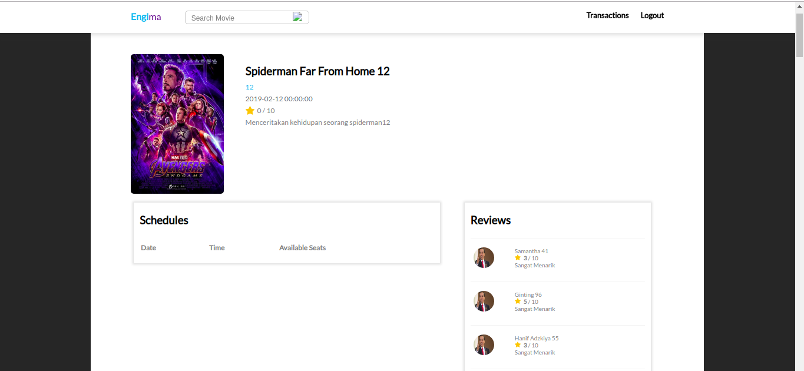
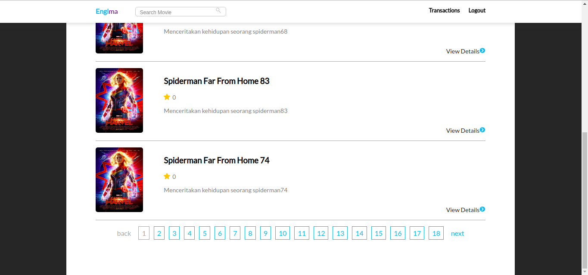
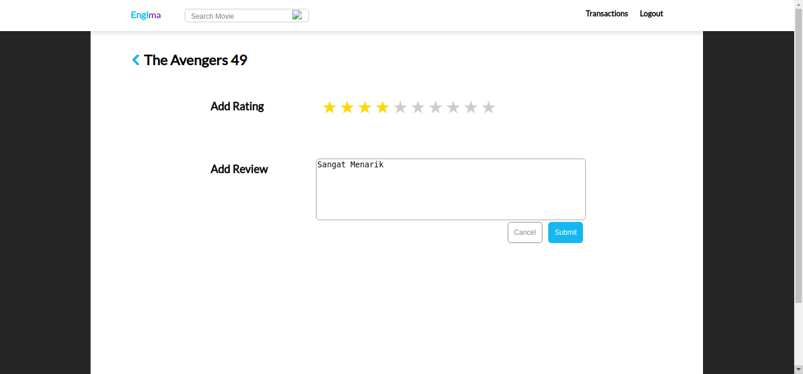
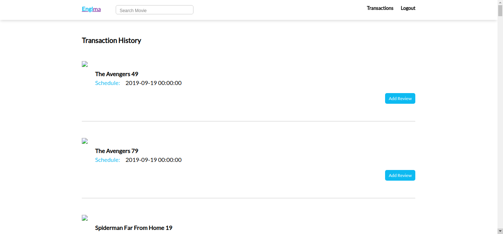

## Deskripsi aplikasi web
Engima Web merupakan website untuk pemesanan tiket bioskop secara daring. Pada website ini, fitur yang disediakan adalah login, register user, pembelian tiket, melihat detail film, memberi ulasan dan rating pada film yang sudah ditonton dan melihat riwayat pembelian tiket.

## Daftar requirement
1. User dapat register
2. User dapat login
3. User dapat logout
4. User dapat mencari film
5. User dapat masuk ke homepage
6. user dapat edit rating
7. User dapat membuat rating
8. User dapat menghapus rating
9. User dapat melihat transaksi
10. User dapat Membeli tike
11. User dapat Melihat detail film
12. user dapat melihat jadwal

## Cara instalasi
Tested with Ubuntu 18.04, PHP 7.2
1. Pindahkan ke localhost apache
2. In case di ubuntu server berada di /var/www/html
3. Konfigurasi database di Config.php
4. Jalankan Migration.php
5. Jalankan semua file di folder Seed untuk generate data.

## Cara menjalankan server
1. Menyalakan XAMPP
2. arahkan localhost/<directory penyimpanan>

## Screenshot tampilan aplikasi

## Penjelasan mengenai pembagian tugas masing-masing anggota (lihat formatnya pada bagian pembagian tugas).
Frontend

Login : 13516060, 13517120
Film Detail = 13517120
User Review = 13517120
Search Result = 13517120
Buy Ticket = 13517120
Register = 13517123
Home = 13517123
Transaction History = 13517123

Backend
API Logout = 13517120
API Buy Ticket = 13517120
API Get User By Id = 13517120
API Login = 13517120
API Cek Cookie = 13517120
API Get Film By Id = 13517120
API Get Review By Film = 13517120
API Get Rating By Film ID = 13517120
API Create User = 13517120
API Add Rating = 13517120
API Delete Rating = 13517120
API Update Rating = 13517120
API Get Film By Jadwal ID = 13517120
API Get Jadwal By Film ID = 13517120
API get Film By ID = 13517120
Add Cookie = 13517120
Delete Cookie = 13517120
API transaction = 13517123
API home = 13517123
API register = 13517123

Kerjaan lain 
Membuat Database = 13517120,13517123
Menggabungkan semua file = 13517120